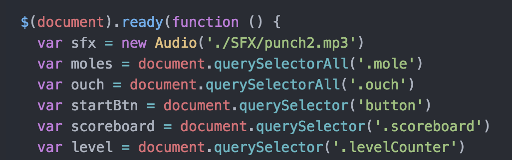
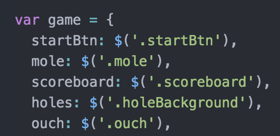

# Whack-a-mole

Classic Whack-a-mole game created as my first project in General Assembly.
Whack the mole by hitting the corresponding keys on your keyboard!

Play here: https://wshimei.github.io/wdi-project-1-wshimei/

# Back story

My first ever coding project created with JavaScript was modeled after a handheld whack-a-mole toy that I used to have. Hence, the 7 holes.

## First Version
First version was created as a project while attending GA's Web Development Immersive Course. It was super buggy and the code were all over the place.

> 
DOM here

## Refactored
Refactored during my time as teaching assistant for GA's WDI-11. Tried out OOP here. Not perfect, but definitely better than the first version.

>
Refactored to OOP and jQuery!

#### Challenges Faced
Animation of mole with CSS transition did not worked with `setTimeout()` function. Solved issue with animate.css.

Had quite a bit of trouble with `checkScore()`. Had to re-write and re-arrange my code a few times to solve the issue.

#### Experience Gained From Refactoring
Overall got more familiar with jQuery and OOP.

# Known Bugs
- At faster speed, mole does not fully appear before hiding again. If you can get to fast enough speed, mole will be totally hidden in the hole.
- Lags a little before first mole appear.

# To be Improved
First and for most, the overall layout. Need a change of background and font css.
Then maybe I will solve the known bugs.
Then maybe I can link it to a backend database and logs the high score of players. So we can challenge each other's high score. Then maybe a full keyboard typing game? Just maybe...

# Built With
- HTML5
- CSS3
- JavaScript
- jQuery

# Author
Shimei Wong - Initial work

# Acknowledgments
Thanks to all my WDI-8 classmates who helped
Also, thanks to my instructor [Prima](https://github.com/primaulia) and TA [Kang Sheng](https://github.com/TayKangSheng) for all the help they provided.
